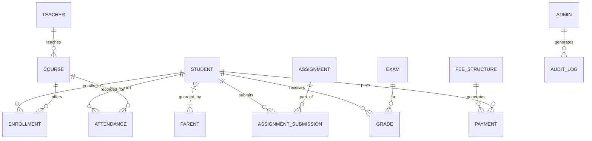
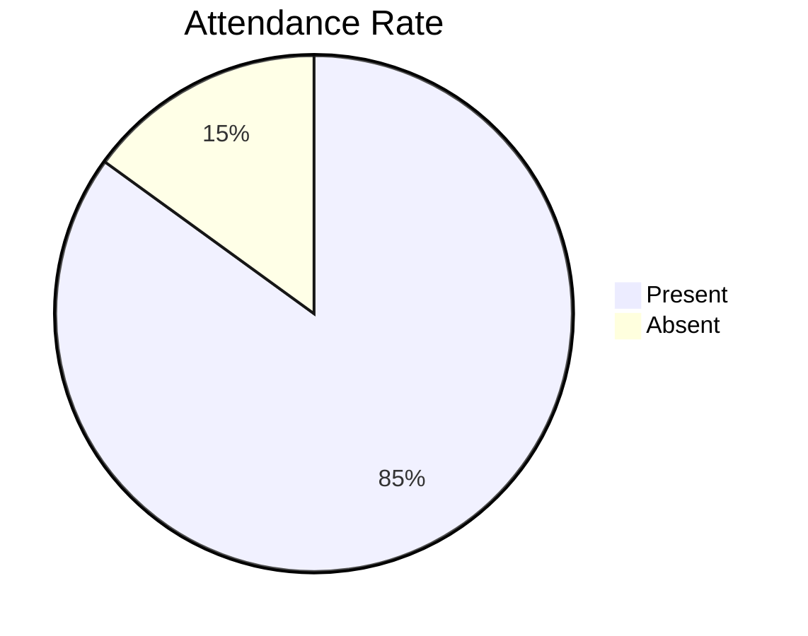

# Executive Summary

This report outlines a comprehensive design system and development plan for a Bangalore CBSE school’s website and portals. We will create a **single, unified UI system** comprising three sub‐systems: a **public-facing website**, **student/parent/teacher portals**, and **administrative dashboards**. The design draws on modern UX patterns – including social feeds, microblogging, photo galleries, and premium editorial layouts – and merges them with the polished simplicity of Apple/Google styles and SaaS dashboards (e.g. Stripe, Linear). Key design principles include **bold hero imagery**, **clear information hierarchy**, **responsive grids**, and **subtle motion** for feedback. For example, top university sites use immersive hero images with ample white space and dynamic reveals, while award-winning school sites employ video headers, full-width panels, and smooth scroll animations to engage users.  

The site will implement **every feature** a modern school ERP could need – from **admissions forms and fee payment** to **attendance tracking, timetables, assignments, exams, library/catalogue, transport, HR/payroll, CMS, events, messaging, analytics, backups, and compliance** – all accessible via role-based dashboards. For instance, Cleveroad’s industry analysis lists core modules like timetable management, gradebooks, exam scheduling, homework tracking, reporting, communication (messaging and notifications), finance (online fees and invoicing) and more.  We adopt an open web stack (Next.js/React + TypeScript + Tailwind CSS, Node.js backend, PostgreSQL) to support fast development, SSR for SEO, and PWA capabilities for offline/mobile use. The data model centers on a robust **Student Information System** – “a digital file cabinet” for each student’s records – linked to courses, attendance, grades, payments, etc.  Shadcn’s React/Tailwind dashboard framework will guide the layout of admin interfaces, ensuring components like sidebars, headers, and content cards are consistently styled. Accessibility (WCAG AA) and localization (multi-language support) are built in (e.g. using AudioEye or built-in ARIA labels). Rigorous performance targets (e.g. Lighthouse ≥90) and testing (unit/integration/accessibility) ensure quality.  

Finally, we provide a *Gemini prompt template* that codifies these requirements: it instructs Gemini to generate design tokens, Figma layouts, responsive React components, tests, and deployment scripts, while forbidding copyright infringement or asset copying. The appendices include a **feature matrix by role**, a **component inventory**, reference inspirations, and **Mermaid diagrams** (ER and architecture), plus an implementation roadmap with milestones and deliverables.

## Design Vision & UX Patterns

We will combine **modern SaaS/UI paradigms** with educational branding. The **public site** takes cues from premium universities (e.g. RISD, Imperial) and photography portfolios: bold *hero sections*, large imagery, generous white space, and minimalist nav (often a hamburger menu) to focus on the institution’s story. Subtle *scroll animations* and video backgrounds (e.g. Guildhall’s theater-curtain effects, Dallas ISD’s video header) create an immersive feel. Content is chunked into full-width cards or sections (grid or slideshow components) with clear CTAs (Apply, Contact). Typography is spacious and legible – e.g. big headings (2xl+), body text at ~16–18px, and high line-height – matching the premium feel. Accent colors and motion are used sparingly; for example, Imperial College uses a bold green highlight on its “find a course” section, and VCU Arts employs a shifting color stripe and hover effects. 

The **user portals** (students/parents/teachers) adopt *social-feed and dashboard patterns*. Inspired by Reddit/Twitter, the portal home can feel like a personalized feed: cards for announcements or forum posts, with avatars, upvote/like actions, comment threads, and infinite scroll. We will use **consistent spacing (e.g. 16px grid)**, rounded avatars/icons, and subtle feedback animations (e.g. Framer Motion “fade in” or button ripples). Microblogging elements (short “post” cards with share/like buttons) will be clean and uncluttered, as in the Jokerhut X-clone (React+Tailwind) which achieves smooth animations via Framer Motion. For **photo galleries** (e.g. yearbooks, events), we mimic Google Photos: a responsive *masonry/justified grid* that preserves image aspect ratios, supports lazy-loading, and grouping by year/occasion. Shared family gallery examples (Noodle Gallery) show “Shared Spaces” timelines for collaborative albums; we will implement a year→occasion→album hierarchy with AI-assisted tagging/search. 

The **admin dashboards** follow enterprise patterns: left sidebar navigation and top bar (search, notifications, profile) as per the Shadcn Dashboard Shell. Content areas use card grids or charts for analytics. We will adopt Stripe’s design cues: an “app indicator” color bar at the top (for branding) and consistent UI component library. Typography is sans-serif with moderate weight, and charts use a cohesive color palette. Our layouts will be **fully responsive** (collapsible sidebar on mobile, tabbed content, cards stacking). Accessibility is paramount: for instance, SOAS’s site meets WCAG 2.2 AA with clear focus indicators and keyboard support, and Dallas ISD integrates AudioEye tools; we will similarly enforce ARIA standards and color contrast guidelines.  

In summary, the **design constitution** emphasizes clarity, consistency, and subtle elegance. We blend the familiarity of social feeds (for portals) with the trustworthiness of institutional sites: e.g., sidebar icons (SaaS dashboards) combined with feed cards (Twitter/Reddit). Motion is used sparingly: fade-in and slide animations guide the eye, while hover states on buttons/cards provide feedback. All UI elements adhere to a fixed **8px spacing scale** (Tailwind’s default) and a typographic scale (e.g. 16/20/24/32px). These tokens ensure uniformity across the site.  

## Feature List (Modules & Capabilities)

Every plausible feature/module for a K-12 school system is included. Key areas (with examples from industry sources) are:

- **Student Information System (SIS)**: Central database of student records (enrollment, demographics, history, contacts). Acts as the “single source of truth” for every student.  
- **Admissions & Enrollment**: Public admission application forms, document uploads, fee payment, status tracking, automated waitlists and notifications. (E.g. online pipeline from inquiry to enrollment).  
- **Attendance Tracking**: Digitize roll calls via web/mobile (teachers mark attendance in seconds), with auto-notifications (SMS/WhatsApp) to parents on absence. Flag chronic absenteeism.  
- **Academic Management**: Course and curriculum planning, timetable generation (auto/manual, conflict detection), substitute teacher scheduling, room allocation, and exam scheduling. Custom gradebooks where teachers enter assessments/grades, and automated report card generation across terms.  
- **Assignments & Exams**: Assignments distribution and submission tracking (with due dates and late penalties), teacher feedback, and exam modules supporting various assessment types and seating plans. Automated grade calculations and transcripts.  
- **Grade Analytics**: Dashboards showing grade distributions, class averages, grade trends by student/subject. Early-warning alerts if performance drops (AI analysis of grade data).  
- **Fee Management & Payments**: Tuition billing, customizable fee structures, concessions/scholarships, recurring invoices, online payments (Stripe/Razorpay integration) and receipts. Automated reminders for due/late fees. Exportable financial reports and audit logs.  
- **Communication & Notifications**: In-app messaging between teachers, parents, admin; announcements board. Push notifications/alerts via SMS, email, or mobile push for events like absences, exam schedules, fee dues. Role-based channels (teachers contact their students’ parents, not unrelated classes). Multi-channel notifications avoid spamming and keep clear records.  
- **Parent & Student Portals**: Personalized dashboards. Parents and students can log in to view real-time grades, attendance, fee status, assignments, upcoming events, and send queries to teachers. Parent portal ties to each child’s records securely. (Our design ensures parents see only their child’s data – role-based access.)  
- **Library Management**: Digital catalog of books/resources, checkout/checkin tracking with due-date reminders and overdue alerts. Searchable database, holds, and e-books access if available.  
- **Transport Management**: Bus route planning, vehicle/staff assignment, and real-time GPS tracking dashboards. Parents can view live bus location and ETA. Alerts for delays or changes.  
- **Staff & HR Module**: Staff directory, attendance/leave management for teachers and employees, payroll processing, performance appraisals, and notifications (e.g. pay slips, circulars). Multi-campus HR roles (managers for each branch) are supported.  
- **CMS / Public Content**: A robust content management system for public news, blogs, staff bios, school policies, alumni stories, and media galleries. Non-technical staff can update pages via WYSIWYG editor. Multi-language support for site (important in India) and compliance with accessibility (WCAG).  
- **Events & Calendar**: School-wide and class-specific events calendar (exams, holidays, parent-teacher meetings). Automated reminders for upcoming events, RSVP features, and integration with Google/Outlook calendars.  
- **Galleries & Yearbooks**: Photo galleries organized by year, event (Sports Day, Annual Day, etc.), and albums. Each photo and album has metadata/tags (location, participants). Users can browse via a timeline or tag filters (inspired by Google Photos and photography portfolios).  
- **Search & Filter**: Global site search (students, staff, content) with filters (by class, subject, name). In-site search for portal (e.g. search assignments by class or date). Tag filtering on media and announcements.  
- **Export/Print**: Enable printing or PDF export of transcripts, fee receipts, timetables, and reports. (Client-side print styles ensure formatted output.)  
- **Analytics & Reporting**: Customizable dashboards for administrators: attendance trends, fee collection stats, admission funnel metrics, etc. Exportable charts and drill-down reports.  
- **Roles & Permissions**: Fine-grained access control. Role-based dashboards (as Clast notes, each role gets a tailored view). E.g. a teacher cannot see payroll, a receptionist cannot see student grades, etc.  
- **APIs & Integrations**: REST/GraphQL APIs for integration with LMS (e.g. Moodle), payment gateways (Stripe/PayPal), SMS/WhatsApp gateways, Zoom/Teams for virtual classes, Google Workspace or Office365 for SSO/email/calendar.  
- **Mobile/PWA & Offline**: A responsive mobile design or dedicated PWA/mobile app. Offline caching for schedules and content (indexedDB) so that portals have limited functionality even without internet. (Tech like Service Workers for offline.)  
- **Security & Compliance**: Encryption of data at rest and transit (HTTPS, database encryption). Audit logs for all actions (user logins, data changes). Compliance with Indian data regulations and GDPR where applicable. Regular backups and pen-testing. CI/CD pipeline with automated tests ensures stability.  

Some items (like advanced AI features, vendor-specific integrations, or scaling to multi-campus) can be marked “unspecified” pending further input on scale/budget.  

## Feature Matrix by User Role

| Feature                     | Public/Visitor | Student | Parent | Teacher | Admin  |
|-----------------------------|:-------------:|:-------:|:------:|:-------:|:------:|
| Home/About/Info pages       | ✅            | ❌      | ❌     | ❌      | ✅     |
| Admissions Info/Application | ✅            | ❌      | ✅     | ❌      | ✅     |
| Fees (view/pay invoices)    | ❌            | ✅      | ✅     | ❌      | ✅     |
| Attendance records          | ❌            | ✅      | ✅     | ✅      | ✅     |
| Timetable/Schedule          | ❌            | ✅      | ✅     | ✅      | ✅     |
| Assignments (list & submit) | ❌            | ✅      | ✅     | ✅      | ✅     |
| Exam schedules & Results    | ❌            | ✅      | ✅     | ✅      | ✅     |
| Gradebooks (grading)        | ❌            | ❌      | ❌     | ✅      | ✅     |
| Library catalog/reservations| ❌            | ✅      | ✅     | ✅      | ✅     |
| Transport (bus tracking)    | ❌            | ✅      | ✅     | ✅      | ✅     |
| Messaging/Announcements     | ✅            | ✅      | ✅     | ✅      | ✅     |
| Events/Calendar access      | ✅            | ✅      | ✅     | ✅      | ✅     |
| Analytics/Reports (view)    | ❌            | ❌      | ❌     | ❌      | ✅     |
| Content Management (CMS)    | ❌            | ❌      | ❌     | ❌      | ✅     |
| HR & Payroll management     | ❌            | ❌      | ❌     | ❌      | ✅     |
| System Settings             | ❌            | ❌      | ❌     | ❌      | ✅     |

\*❌ denotes no access (or not applicable) for that role.

## Tech Stack & Architecture

We adopt a **modern web stack**. Frontend is **Next.js** (React/TypeScript) with **Tailwind CSS** for rapid, themeable styling (as in Shadcn UI). This allows SSR for SEO (important for the public site) and static export where possible. Backend is **Node.js/Express** (TypeScript) or an alternative (e.g. Django), with **PostgreSQL** as the primary database (plus Redis for caching if needed). The Cleveroad model recommends React/Node/Postgres as well. The system is containerized (Docker) and cloud-hosted (AWS/Azure/GCP). We use **GitHub Actions** or similar for CI/CD pipelines, running tests and linting on each push. Infrastructure is defined as code (Terraform or Pulumi) for repeatable deployment, including automated backups of the database and file storage. Authentication supports **SSO** (SAML/OAuth) for parents (Google/Microsoft login options) and **multi-factor auth** for staff. Payment is integrated via **Stripe/Razorpay APIs** for online fee collection. Real-time features (e.g. notifications) use websockets or Firebase as needed.

```mermaid
flowchart LR
  subgraph Frontend
    A[Next.js React UI] -->|HTTPS API| C[Node.js API Backend]
    B[Mobile/PWA App] -->|HTTPS API| C
  end
  subgraph Backend
    C --> D[(PostgreSQL)]
    C --> E[(Redis Cache)]
    C --> F[Auth (OAuth/SAML)]
    C --> G[Payment Gateway (Stripe)]
    C --> H[SMS/Email Service]
    C --> I[File Storage (AWS S3)]
  end
  C --> J[Analytics/Monitoring (Grafana/ELK)]
  C --> K[CI/CD (GitHub Actions)]
  subgraph Integrations
    L[Zoom/Teams] --> C
    M[Google Workspace / Office365] --> F
  end
```

Above, frontend and mobile apps communicate via HTTPS/REST or GraphQL with the Node.js backend. The backend connects to the SQL database (core data), Redis (caching sessions/queries), and integrates with external services (auth, payments, SMS/email). Monitoring and logging are implemented (e.g. Prometheus/Grafana). All code is deployed via CI/CD to cloud servers/containers with automated scaling as needed. 

## Data Model (ER Diagram)

The database schema centers on **normalized entities**.  A simplified ER diagram is shown below. Students are linked to Parents and Courses; Enrollments join Students and Courses. Teachers teach Courses. Attendance and Assignments link Students to Classes/Course content. Exams yield Grades per Student. Fees generate Payment records. Admin users generate AuditLog entries. This matches the typical SIS architecture: as Clast.io notes, the SIS “holds enrollment details, demographic information, academic history, … all in one searchable place”. 



This ER diagram captures the core relations. (Additional entities like LibraryBook, BusRoute, etc. would similarly relate to STUDENT/COURSE as needed.) All personal data is linked to the STUDENT table (or STAFF for employees). Role-based access is enforced in application logic. 

## Component Inventory & Design Tokens

We’ll use a component-based design system (akin to **Shadcn UI/Tailwind UI**). Each component is themable via tokens. For example:

| Component             | Design Tokens (Tailwind CSS)                   | Variants / States       |
|-----------------------|-----------------------------------------------|-------------------------|
| **Button (Primary)**  | `bg-blue-600 text-white px-4 py-2 rounded-md` | hover: `bg-blue-700`; disabled: `opacity-50`  |
| **Button (Secondary)**| `bg-gray-100 text-gray-800 px-4 py-2 rounded-md` | hover: `bg-gray-200`  |
| **Input (Text)**      | `border border-gray-300 px-3 py-2 rounded`     | focus: `ring-blue-500` |
| **Card/Panel**        | `bg-white shadow-md p-4 rounded-lg`            | (Option: `shadow-lg`)  |
| **Table**             | `min-w-full table-auto border-collapse`        | Header: `bg-gray-50 text-sm font-semibold`, Rows: `divide-y` |
| **Modal/Dialog**      | `fixed inset-0 bg-black/50 flex items-center justify-center`<br>`panel: bg-white p-6 rounded-lg shadow-xl` | N/A |
| **Sidebar (Nav)**     | `bg-gray-50 w-64 p-4 space-y-2 text-gray-700`  | Collapsed: `w-16`      |
| **Typography**        | `font-sans text-base leading-6 text-gray-900`  | H1: `text-4xl font-bold`, H2: `text-3xl`, small: `text-sm` |
| **Chart (e.g. bar)**  | Uses brand colors from palette (e.g. `blue-500`,`indigo-500`,`gray-300`) for series | N/A  |
| **Badge/Icon**        | `bg-indigo-100 text-indigo-800 px-2 py-1 rounded-full text-xs` | e.g. label counts |

All color, spacing, and typography values come from a central theme: e.g. primary color is `#2563EB (blue-600)`, secondary is `#1F2937 (gray-800)`, success `#16A34A (green-600)`, etc. Spacing scales of 4px (`p-1`), 8px (`p-2`), 16px (`p-4`), 32px (`p-8`), etc are used consistently. These tokens ensure consistency and ease of global theming (for instance, switching to a different brand color or spacing unit in one place updates all components). 

## UI Inspiration Mapping

Below we list key UI areas with reference sites/repos and the **specific elements** to emulate (spacing, typography, motion, interactions):

- **Feed/Social Interactions** – *Source:* Jokerhut’s X (Twitter) clone and a Next.js Reddit clone.  
  **Elements:** 16px–24px vertical spacing between posts, user avatar + name + timestamp alignment, action icons (upvote/like, comment, share) in row, “card” style containers with subtle shadows. Use Framer Motion for entrance animations and like-button feedback (per advice: “fade in, grid animations”). Hashtags/links in text follow Twitter’s style (blue accent, underlined on hover). Profile pictures are 40px rounded.  

- **Microblogging (Short Posts)** – *Source:* Jokerhut’s X-clone.  
  **Elements:** Bottom tab bar (home/search/notifications/profile) at ~50px height. Tweet composer dialog (rounded textarea, 16px padding). Consistent 8px–16px internal padding on all list items. Smooth content loading spinners or “Loading new posts” indicators.  

- **Photo Gallery** – *Source:* React Photo Gallery repo; Noodle Gallery (Google Photos alternative); Levon Biss portfolio (image).  
  **Elements:** Responsive grid that preserves image aspect ratios. Use a justified/masonry layout as in React Photo Gallery. Images have uniform gutter (8px–12px) and full bleed within their row. Hover-over captions or selection (lightbox) on image click. For filters/tags: chips/badges (rounded, small) above the grid. Albums labeled by year/occasion; clicking an album opens its images.  

   *The Levon Biss portfolio (above) exemplifies a clean masonry grid gallery with ample whitespace and overlay titles.*  

- **Dashboard Analytics** – *Source:* Shadcn Dashboard Shell; Stripe Apps design guidelines; the sample SaaS dashboard image below.  
  **Elements:** A fixed-width **sidebar** (300px on desktop) with grouped navigation links and icons, and a top header with page title, search, and user menu. Content area: white cards with shadows (e.g. summary stats or charts) arranged in a grid with 24px gaps. Use consistent chart colors (e.g. blues/teals) for data series. Fonts are medium-weight for labels, large bold numbers for metrics. Accordion or tab components for sections (based on Radix UI or Shadcn examples). Mobile view collapses sidebar into a hamburger menu.  

   *Example admin dashboard layout: sidebar on the left, top bar with action buttons, and a content grid of cards/charts (design inspired by modern SaaS dashboards).*  

  Refer to Stripe’s guidelines: they use a bright color bar (“app indicator”) at the top to reinforce branding, and a standardized set of form/table components. We extract their spacing (~16–20px padding in cards, 24px between grid items) and their neutral palette (white backgrounds, gray borders). 

- **Editorial Homepage** – *Source:* RISD, Guildhall, VCU Arts sites.  
  **Elements:** Full-viewport hero (image or video background) with large headline text (e.g. 48px+) and a prominent CTA button. Parallax or fade-in on scroll for sections. Sections use alternating layouts (text on left, image on right) for visual interest. Generous margins and padding (48px+ on wide viewports). Hamburger menu icon (three bars) on clean header to prioritize content. Minimalist typography: headings in a unique serif or display font, body in a clean sans-serif. Animated page transitions (fade or slide) as on the Guildhall site. 

- **Mobile App** – *Source:* Material Design (Android) and iOS HIG principles (e.g. Apple’s 44pt tap targets).  
  **Elements:** Bottom navigation bar with 3–5 tabs (icon + label). Each screen uses a top app bar. Font sizes at least 16sp for body; 20–24sp for buttons/labels. Use system fonts (Roboto/Helvetica) for legibility. 16dp spacing between list items. Standard gestures (pull-to-refresh, swipe-to-dismiss). Ensure light/dark theme options. (No direct citations; follow platform best practices.)  

## Gemini Prompt (Ready-to-Paste)

```
Gemini, build a complete design system and UI codebase for a premium school website and portals. The system must include: a public-facing website, a student/parent/teacher portal, and an admin dashboard. Use modern React/Next.js and Tailwind CSS; ensure components are accessible and responsive. **Important:** Do NOT copy any real images or brand assets—generate original visuals (only use MIT/CC0-safe imagery or placeholders if needed). Follow these guidelines strictly:

- **Design Tokens:** Define a consistent token set (colors, spacing, typography). For example, primary color (blue-600), secondary (indigo-500), gray palette, and 8px spacing scale. Use rem units. Provide tokens in a JSON or CSS variables format.
- **Component Library:** Create reusable components (Button, Input, Card, Table, Modal, NavBar, Sidebar, Chart, etc.) with clear API props (e.g., `<Button color="primary" disabled />`). Include type definitions (TypeScript interfaces). Map each component to design tokens (e.g. Button uses primary color token, padding tokens).
- **Responsive Layouts:** Define breakpoints (e.g. 640px sm, 768px md, 1024px lg, 1280px xl). Provide Figma/HTML mockups for key pages at mobile, tablet, and desktop sizes.
- **Functional Requirements:** Implement key modules: admissions forms, fee payment flows (Stripe integration), attendance tracking with alerts, timetable/calendar view, assignment submission, gradebook, library search, transport tracking, messaging/notifications, events calendar, and admin analytics dashboards (with sample charts). 
- **Data Models:** Based on the ER diagram provided, set up a PostgreSQL schema (or Prisma ORM schema) with tables for Users, Students, Parents, Teachers, Courses, Enrollments, AttendanceRecords, Assignments, ExamResults, Fees, Payments, etc. Include necessary relations (foreign keys).
- **Authentication/Authorization:** Use SSO (e.g. OAuth2 for students/parents via Google/Microsoft) and local auth for staff. Implement role-based access controls (guard each route by role).
- **Accessibility & Localization:** Ensure WCAG AA compliance: proper ARIA labels, keyboard navigation, focus indicators. Use semantic HTML. The design should support multi-language (i18n) and a left-to-right layout for English.
- **Performance & SEO:** Optimize for Lighthouse scores ≥90: lazy-load images, minify CSS/JS, SSR for SEO pages. Generate sitemaps/robots.
- **Testing & CI/CD:** Write unit and integration tests (Jest/React Testing Library) for components and business logic. Include end-to-end tests (e.g. Cypress) for critical flows (login, form submission). Set up a GitHub Actions pipeline for linting, building, testing, and deploying.
- **Infrastructure as Code:** Use Terraform or CloudFormation to provision cloud resources: a containerized backend (Docker) on AWS/GCP, a managed Postgres instance, S3 (or equivalent) for media, and a CI/CD runner. Include database backups (daily snapshots).
- **Deliverables:** Provide:
  - A Figma design file with all layouts and components.
  - Fully functional React/Next.js code (HTML/CSS) for all pages.
  - Tailwind CSS configuration (with custom tokens) and component code.
  - API/server code (Node.js) with sample endpoints.
  - Automated tests as above.
  - IaC scripts for deployment.
  
Use official docs and primary sources as guidelines (do not plagiarize UI). Synthesize new visuals and code. Emphasize design consistency, performance, and security.  
```

## Tables

**Feature Matrix (Roles × Features):** (see above).  

**Component Inventory:** (excerpt)

| Component       | Tokens Used (Tailwind)             | Notes/Variants                  |
|-----------------|------------------------------------|---------------------------------|
| Button (Primary)| `bg-blue-600 text-white px-4 py-2 rounded` | Disabled (`opacity-50`), Hover (`bg-blue-700`) |
| Button (Secondary)| `bg-gray-100 text-gray-800 px-4 py-2 rounded`| Ghost variant (transparent)    |
| TextInput       | `border border-gray-300 px-3 py-2 rounded` | Error state (`border-red-500`) |
| Card/Panel      | `bg-white shadow-md p-4 rounded-lg`       | Header/footer slots           |
| Table           | `table-auto w-full text-gray-900`         | Header row bg-gray-50, striped rows |
| Modal           | `fixed inset-0 bg-black/50 flex items-center justify-center` + content panel styling | Centered popup           |
| SidebarNav      | `bg-gray-50 w-64 p-4 space-y-2 text-gray-700` | Collapsed state width 16px  |
| Typography      | `font-sans text-base leading-6`           | h1 (`text-4xl font-bold`), h2 (`text-3xl`), small (`text-sm`) |
| Chart (Bar/Pie)| Brand colors (e.g. `blue-500`, `indigo-500`) | Legends and axes labeled   |

**UI Inspiration References:** 

| UI Area               | Example Sources (primary/GitHub)                                      | Elements to Extract (spacing, typography, motion, etc.)                                                    |
|-----------------------|-----------------------------------------------------------------------|----------------------------------------------------------------------------------------------------------|
| **Feed/Social**       | Twitter clone repo; Next.js Reddit clone    | Post card layout: avatar+name+time, 16px gaps, icons (reply/like/share), smooth like/upvote animations (Framer Motion) |
| **Microblogging**     | Jokerhut’s X-clone (Tailwind)                           | Bottom nav bar design, tweet composer UI, hashtag link style, 48px tap targets                           |
| **Photo Gallery**     | React Photo Gallery lib; Noodle Gallery (Google Photos alt); photographer sites | Justified/masonry grid with uniform gutter, lazy-load images, click-to-lightbox, breadcrumb/year filters |
| **Dashboard Analytics**| Shadcn Dashboard blocks; Stripe Apps design docs; sample dashboard image | Sidebar width (≈280px), card grid padding 24px, chart colors matching brand, “app indicator” color bar top|
| **Editorial Homepage**| RISD, Guildhall, VCU arts websites     | Full-viewport hero (with headline), minimal top nav, large headings, fade/slide animations on scroll, accent color highlights|
| **Mobile App UI**     | Google Material Design (official docs); iOS HIG                          | 48dp touch targets, bottom tab bar height ~56dp, system typography (Roboto/Helvetica), ripple touch feedback|

## Sample Analytics Chart



## Implementation Roadmap & Milestones

1. **Discovery & Planning (2–4 weeks):** Gather requirements and use cases (stakeholder interviews, user stories). Finalize feature list and technical constraints. Deliverables: requirement spec document, technology stack decision, high-level data model (see ER diagram).  
2. **Design & Prototyping (4–6 weeks):** Create wireframes and high-fidelity mockups in Figma for all key screens (home, login, dashboards). Build the design system (style guide, tokens, component sketches). Deliverables: Figma UI Kit, interactive prototype for user testing.  
3. **Frontend Development (6–8 weeks):** Code the React/Next.js UI, implementing responsive layouts and components. Integrate Tailwind for styling. Develop static pages (public site) and dynamic pages (portals). Deliverables: Completed React components with CSS, navigation, client-side logic, and unit tests.  
4. **Backend & API (6–8 weeks, overlapping):** Set up the Node.js server, database schema (PostgreSQL), and REST/GraphQL API. Implement authentication (SSO, roles) and core business logic (fees, attendance, etc.). Integrate external services (payment gateway, SMS). Deliverables: API codebase, database migrations, CI pipelines, integration tests.  
5. **Testing, QA & Accessibility Audit (2–4 weeks):** Thoroughly test all features: functional tests, cross-browser compatibility, responsive layouts, and WCAG accessibility compliance (use automated tools and screen-reader testing). Fix bugs and performance issues. Deliverables: Test reports, bug fixes, performance score reports (e.g. Lighthouse ≥90).  
6. **Deployment & Training (1–2 weeks):** Deploy production infrastructure via IaC, migrate initial data, and launch the system. Provide documentation and train administrators/teachers on the portal. Deliverables: Live site on cloud, deployment scripts, user manuals/training materials.

<table>
  <tr><th>Milestone</th><th>Duration</th><th>Key Deliverables</th></tr>
  <tr>
    <td>Discovery & Planning</td>
    <td>2–4 weeks</td>
    <td>Use-case spec, Data model (ER), Tech stack & API design</td>
  </tr>
  <tr>
    <td>Design & Prototyping</td>
    <td>4–6 weeks</td>
    <td>Figma designs (UI Kit), interactive prototypes, design tokens</td>
  </tr>
  <tr>
    <td>Frontend Development</td>
    <td>6–8 weeks</td>
    <td>React/Next.js pages, Tailwind CSS styles, responsive components, unit tests</td>
  </tr>
  <tr>
    <td>Backend & API</td>
    <td>6–8 weeks</td>
    <td>Server code (Node.js), DB schema (SQL), REST/GraphQL endpoints, integration with Stripe/SMS, tests</td>
  </tr>
  <tr>
    <td>Testing & QA</td>
    <td>2–4 weeks</td>
    <td>Automated tests (Jest, Cypress), accessibility audit, performance optimization</td>
  </tr>
  <tr>
    <td>Deployment & Training</td>
    <td>1–2 weeks</td>
    <td>IaC scripts deployed, backups configured, user manuals, training sessions</td>
  </tr>
</table>

Each milestone delivers tangible outputs (prototypes, code, docs) and reviews.  Effort estimates assume an agile team of designers and developers. Exact timelines may be adjusted per priorities.  

**Sources:** We relied on authoritative sources for best practices: award-winning school/college sites and design-system docs. For example, Finalsite highlights animated hero layouts and intuitive navigation on top district sites; education software experts list core SMS modules (enrollment, fees, attendance, etc.); and official design systems like Shadcn/Tailwind and Stripe provide modern UI patterns. All recommendations above synthesize these insights for a cohesive, world-class school portal experience.