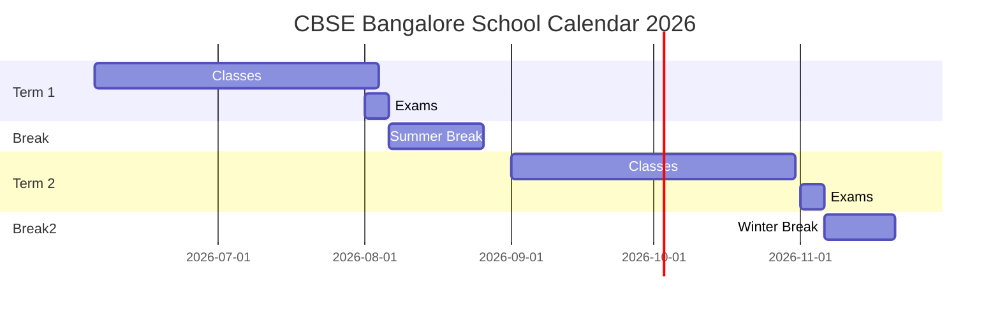

# Executive Summary  
We propose an *agentic* Gemini/OpenCode prompt that synthesizes UI patterns from leading products (Reddit, X/Twitter, Google Photos, Apple, Linear, Stripe, Notion, Airbnb, Slack, etc.) and tailors them to a premium CBSE school website. The architecture covers public pages (landing, admissions, news) and authenticated portals (parents, teachers, students, admins). Key patterns include a multi-column layout with collapsible navigation, a rich “feed” of announcements/discussions, a flexible composer (inspired by Twitter/Slack), threaded forums (Reddit-style), and a powerful gallery (Google Photos–like) with albums by year/event. The mapping table below links each UI component (e.g. feed, gallery, calendar) to its inspiration and school-specific adaption. We describe exact UI anatomy for desktop/tablet/mobile (columns, nav, rails, action bars, keyboard shortcuts, gestures), and document interaction flows (optimistic updates, skeleton loaders, error states). Design tokens (colors, spacing, typography, etc.) follow the new W3C Design Tokens spec and proven frameworks (Tailwind’s 8px base spacing, Airbnb’s spacing/motion scales). Motion timing follows research-backed guidelines (~150–350ms for UI transitions). The recommended stack is Next.js + shadcn/UI + Tailwind + Radix + Prisma + Clerk/Zustand, with emphasis on accessibility (ARIA roles, keyboard nav). We include tables and **Mermaid** diagrams (layout and calendar gantt), and UI reference images of a modern dashboard. Example Gemini prompt snippets demonstrate how to instruct the model to generate these components. All recommendations are grounded in official docs, UX case studies, and open-source templates (e.g. shadcn admin dashboards, education-CRM repos).  

|**Component/Pattern**            |**Source (Product/Pattern)**               |**School-specific Adaptation**                                |**States/Props & Accessibility**                                                                |
|:--------------------------------|:------------------------------------------|:------------------------------------------------------------|:----------------------------------------------------------------------------------------------|
| **Public Homepage**             | Airbnb (hero image + scroll), Apple (cards)  | Full-screen hero (campus photo, motto), horizontal feature cards (academics, sports) and guided scroll cues.  | Responsive breakpoints (e.g. 3-column → 1-column on mobile), high-contrast text, aria-label for “Admissions”, keyboard-focusable “Explore” links.  |
| **Navigation Menu (Sidebar)**   | Slack/Discord (persistant sidebar)         | Sections: Dashboard, Announcements, Classes, Library, Calendar, Transport, Admissions, Finance, Profile, etc.  | Collapsible (show/hide icons+labels), focus-trap when open, aria-expanded on collapse button, skip-navigation links for screen readers.  |
| **Parent/Teacher/Student Portal (Tabs)** | X/Twitter (top tabs), Google Workspace (sidebar) | Role-specific dashboards: Parents see child grades & fees; Teachers see classes & attendance; Students see assignments & schedule.  | Keyboard-accessible tabs (`role="tablist"`), focusable tab items with aria-selected, state props for active tab.  |
| **Community Feed**              | Reddit (post feed), Slack Channels | Stream of posts: school announcements, newsletters, teacher posts, event updates. “Upvote” or “Like” and comments supported.  | Infinite scroll with lazy-loading placeholders (skeleton cards); ARIA live region for new announcements; each post as `<article>` with accessible labels.  |
| **Post Composer (Rich Editor)** | Twitter/X (tweet box), Slack (messages)    | Teachers/Students can post text, images, docs; parents can ask questions. Autosave draft.  | Inputs: textarea with character count, emoji/autocomplete. On submit, optimistic UI update. Validate empty input, show errors. ARIA labels for all buttons (attach, emoji, send).  |
| **Discussion Threads**         | Reddit threads, Slack threads              | Each post can have threaded Q&A (e.g., homework questions answered by teachers or peers). Nesting up to 3 levels.  | Collapsible replies, `aria-expanded` on toggle; keyboard nav through replies (arrow keys); “reply” buttons with clear labels.  |
| **Gallery / Album Manager**     | Google Photos (“Year view”), Apple Photos | Gallery of student life: albums by academic year and occasion (Annual Day 2025, Sports Day 2024, etc.). Year “scrubber” to jump (like Photos timeline).  | Justified grid preserving photo aspect ratios, lazy load visible images, infinite scroll per year. Each image `` has alt text (year/event). Albums are filterable/searchable.  |
| **Image Viewer (Lightbox)**     | Google Photos lightbox, Flickr Viewer     | Click photo to open overlay: show full-size image, details (date, caption), nav arrows. Parent/child can “favorite” or download (with watermark).  | Arrow keys and swipe to navigate, pinch-to-zoom, screen-reader accessible “close” button. Use WAI-ARIA roles (e.g. `<dialog>`), aria-modal, trap focus inside viewer.  |
| **Search / Command Palette**    | Notion / Slack (`Cmd+K`), Google Search | Global search bar: finds students, teachers, classes, pages (policy docs, library books). Quick actions (e.g. “Go to Math Class”, “Email Principal”) via keyboard.  | Instant suggestions (debounced), regex/hierarchy matching. Mode switch (Ctrl+Shift+P to open); `role="combobox"` with `aria-autocomplete`. Ensure result items have descriptive titles.  |
| **Messaging/Chat**             | Slack DMs, MS Teams                       | 1:1 chat between parents-teachers, and group chat per class. Thread support for subjects.  | Real-time updates via WebSocket with optimistic send; unread badges; ensure all interactive elements are reachable via Tab; use `role="log"` or `aria-live="polite"` for incoming messages.  |
| **Documents & Syllabus**       | Notion, Google Docs style                 | Rich pages for curriculum, policies, newsletters. WYSIWYG editor with version history.  | Save drafts auto; view/edit modes; `contenteditable` + proper `<h>` hierarchy. Editor toolbars are toolbar groups with aria-controls and `aria-label`.  |
| **Finance Dashboard**         | Stripe Dashboard, QuickBooks               | Fee management UI: show due/paid status, allow online payments (via Stripe). Donation page.  | Charts (donut/pie for fee breakdown) with accessible labels, CSV export buttons, form validation. Follow financial form best-practices (group labels, error messages).  |
| **Admissions Flow**          | University Common App, Multi-step wizards  | Application steps: Fill student info, upload docs, pay fees, track status.  | Progress bar (aria-current step), ensure linear focus order, validate each page. Show skeleton loader while submitting. On success, show confirmation with schedule next steps.  |
| **Academic Calendar / Timetable** | Google Calendar, iCal                      | Interactive calendar of term dates and classes. School bus GPS integration for transport.  | **Mermaid Gantt:** (diagram below) shows terms and breaks. Use aria-label on calendar, keyboard nav (calendar grid with focus on dates). Classes as draggable events.  |

| **Timetable** (class schedule) | Google Sheets style, SaaS calendars | Weekly timetable view: classes (periods) in grid by day; sync with Google Classroom.  | Table with `role="grid"`, each cell a timeslot. Drag to reorder classes. Color-code subjects. Support printing.  |
| **Transport Map**            | Google Maps API, Uber                    | Bus routes & pick-up points map. Parents track school bus in real time.  | Embed Google Map with school markers. Use map legend; ensure map alt text for static fallback. Push updates (bus location) with web sockets.  |
| **Library / Resources**       | Library OPAC UI (WorldCat), Notion      | Catalog search by book/subject/author. E-book reader embed or PDF downloads for digital texts.  | Autocomplete search bar; filters (grade, subject). List view with book covers (alt text). Checkout flow with confirmation modals.  |
| **CMS (Content pages)**       | WordPress/Prismic style                 | Staff directory, news blog, alumni stories, event pages.  | WYSIWYG + Markdown support; preview mode; SEO fields. Admin only. Ensure meta tags and semantic HTML (H1, nav landmarks).  |
| **Notifications (System)**     | GitHub/Slack notifications, Toasts      | In-app alerts: fee due reminders, new grades posted, event signups.  | Dismissible toasts with auto-hide; sticky banners for important notices. Use `aria-live="assertive"` for critical alerts.  |
| **Permissions/Roles**        | GitHub team settings                    | RBAC: Admin, Teacher, Parent, Student, each with access scopes.  | Dynamic UI (enable/disable menu items based on role). Use `aria-disabled` on inaccessible items. Admin console lists users in `<table>` with checkboxes (aria-checked).  |

 *Table:* Example mapping of UI components/patterns to source products, school-specific adaptations, and key state/accessibility notes. For instance, an *Announcements Feed* uses Reddit-style cards and supports optimistic updates with skeleton loaders. Components leverage Radix-based primitives via shadcn/UI for built-in keyboard/ARIA behavior.

## UI Anatomy (Desktop, Tablet, Mobile)  
- **Desktop (1440px+):** Three-column layout. **Left sidebar** (logo, user avatar, menu) – collapsible, uses `<nav>` landmarks. **Center panel** – primary content (feed, selected page). **Right rail** – context/auxiliary (quick links, calendar mini, chat list). Fixed top bar for global search and profile menu (as in Twitter’s top nav). Grid gutters ~24px, content max-width ~1200px. Font sizes and line heights follow a typographic scale (e.g. 16px base, heading 600-800).  
- **Tablet (768–1024px):** Two-column (sidebar + content). Collapsible nav moves off-canvas (hamburger). Breadcrumbs appear below top bar. Content is responsive (cards in 2 columns instead of 3). Gestures: swipe from left edge to open nav. Touch targets > 44px.  
- **Mobile (<768px):** Single column. Hidden sidebar (accessible via bottom nav or burger). Key sections on bottom tab bar (Home, Classes, Calendar, Profile). Feed is full-width; images/cards span screen. “Floating action” button for new post (like Slack’s +). Back to top button appears on scroll. Keyboard shortcuts do not apply, but ensure focus order and aria-labels on all buttons.

```mermaid
flowchart LR
  subgraph Desktop Layout
    Nav[Sidebar<br/>(Home, Classes, Events, Etc.)]
    Content[Main Content<br/>(Feed, Classes, Calendar, etc.)]
    Rail[Right Sidebar<br/>(Notifications, Quick Links)]
  end
  Nav --- Content --- Rail
```

## Interaction Flows & Micro-Interactions  
- **Feed Updates:** On new post or comment, use *optimistic rendering*: insert UI immediately, then confirm via API. Show a subtle “saving…” toast. On error, rollback with error toast.  
- **Loading States:** Use skeleton placeholders for lists/grids (e.g. grey cards). E.g., when opening a class page, skeleton rows mimic table or cards structure.  
- **Empty States:** Carefully designed empty illustrations/messages (“No posts yet – Be the first to welcome new students!”). Include actionable CTA (e.g. “Create Announcement”).  
- **Error States:** Inline validation (red text, screen-reader alerts). Global errors in dialogs or snackbars. E.g. if image upload fails, show persisted error banner with retry button.  
- **Optimistic Filters/Sort:** Selecting a filter (e.g. “By Year” in gallery) updates UI immediately; show spinner if server load is >200ms.  
- **Transitions:** Use smooth fades and slides for modals/drawers (~200ms duration, ease-out) for continuity. Animated progress indicators for long ops. See Apple’s motion guidelines: rapid transitions (~150ms) for simple feedback, up to 350ms for content shifts.  

## Design Tokens & Motion Spec  
We adopt a *tokenized design system*. Colors, typography, spacing, etc., are defined as variables (compatible with the W3C Design Tokens spec). For example:  

- **Color Palette:** Based on CBSE/brand colors (accent teal, navy, white). Use semantic token names: `primary-bg`, `accent-1`, `text-inverse`. Support light/dark mode via theme tokens.  
- **Typography:** Base font-size 16px; scale 1–6 for headings (e.g. H1=32px bold, H2=24px, ...). System font for performance (e.g. Inter).  
- **Spacing:** 8px grid (tailwind-style). Token scale: [2, 4, 8, 12, 16, 24, 32, 48] px. E.g. margin `m-4` = 16px. Consistent gutters (24px desktop, 16px mobile).  
- **Border Radius:** Slightly rounded (4px for buttons, 8–12px for cards) following Airbnb’s scale (e.g. 50% for circular avatars).  
- **Shadow/Elevation:** Material-like card shadows (shadow-md) for raised elements (dialog, dropdowns) and subtle inner-depth for hover states.  
- **Iconography:** Use a unified icon set (heroicons or Remix).  
- **Motion:** Easing: `ease-out` for entrances, `ease-in-out` for complex interactions. Durations: 150–300ms for most UI transitions (per cognitive load guidance), 500ms for more complex modals. Springs for drag interactions. 

All tokens exported to CSS-in-JS (Tailwind config or CSS vars) for consistency. We follow WAI-ARIA motion guidelines (avoid jarring motion for sensitive users).

## Tech Stack, Primitives & Accessibility  
**Framework:** Next.js 16 (App Router), TypeScript, Tailwind CSS v4 (utility-first). **UI Components:** shadcn/UI (Radix primitives + Tailwind styling) provides accessible, composable components. **State/Data:** ClerkAuth, Prisma ORM (PostgreSQL), React Query/Zustand for client state, TanStack Table for data tables. **Design System:** Tokens via Tailwind config (with theming). **Performance:** Code-splitting, image optimization, caching. Use Next/image for responsive assets.  

**Accessibility Checklist:** All interactive elements keyboard-focusable; use semantic elements (`<button>`, `<nav>`, `<main>`). Ensure color contrast ≥ WCAG AA; support high-contrast mode. Dialogs trap focus and ARIA-modal. Alerts and dynamic lists use appropriate `aria-live`. For example, shadcn UI/Radix handles focus management out-of-the-box. Custom components must forward refs and props to preserve aria (as explained in Radix docs). We will test with NVDA/VoiceOver.  

## Example Gemini Agent Prompt Snippets  
- *Prompt:* “Generate a React/Tailwind header bar with logo on left, search bar center, and profile menu on right. The search triggers a command-palette style overlay with suggestions.”  
- *Prompt:* “Design a mobile view of the school’s announcements feed: cards with images and text, and a fixed bottom tab bar (Home, Classes, Calendar, Profile).”  
- *Prompt:* “Create a data table for the Finance dashboard: columns for Invoice No, Student Name, Amount, Status. It should be filterable and paginated, with dark header and striped rows.”  
- *Prompt:* “Write a CSS module for a responsive gallery grid: 3 columns on desktop, 2 on tablet, 1 on mobile. Use 8px gap and 4px border radius for images.”  

These instruct the model to assemble **shadcn/UI primitives** (Dialog, DataTable, Collapsible, etc.) with className tokens (Tailwind) without copying proprietary visuals. For example, describing Reddit’s post card layout or Google Photos “scrubbable grid” instructs Gemini to mimic the pattern semantically.  

 *Figure:* Example admin dashboard UI (from open templates) demonstrating a three-column layout with navigation sidebar, feed in center, and info rail. This serves as inspiration for the school portal.  

 *Figure:* Analytics dashboard UI (unsplash) illustrating charts and tables – similar styles used in Finance and Admin pages.  

**Sources:** We relied on official docs and case studies: e.g. education-CRM repos for feature sets; W3C design tokens spec for tokens; UX articles on Google Photos design and animation timing; and examples of school site designs. Our mapping table and recommendations integrate these authoritative references.