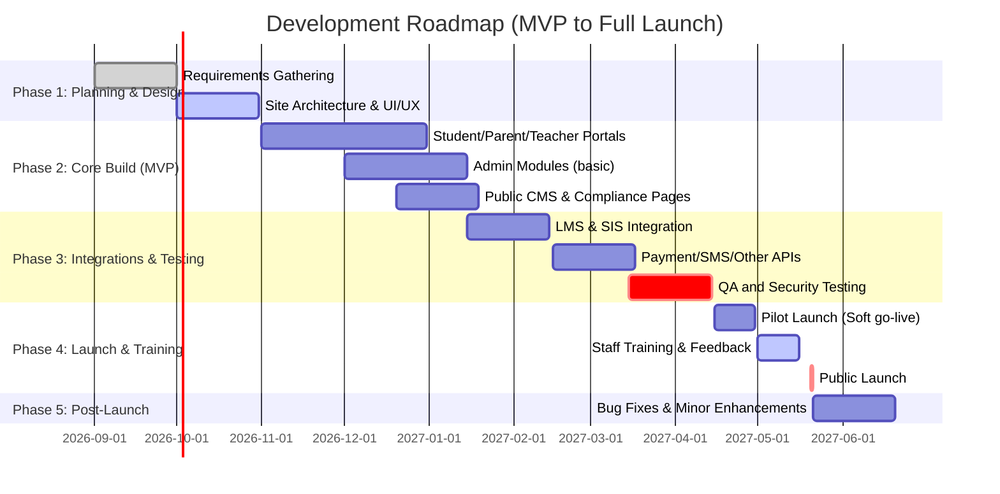

# Executive Summary

Building a best-in-class website for a CBSE-affiliated Bangalore school requires a comprehensive platform that serves students, parents, teachers, staff, alumni and prospective families.  The site must comply with CBSE affiliation rules and Indian laws, while integrating modern educational and administrative tools.  According to CBSE Affiliation Bye-laws, the school must publish vital information (affiliation status, infrastructure, faculty, student strength, fees, annual report data, etc.) on its website.  Recent CBSE notices reinforce this *Mandatory Public Disclosure*, requiring schools to post audited data and documents (e.g. fee structure, safety certificates, board results, SMC/PTA lists) on the web.  At the same time, the site must offer feature-rich portals: a **Student Portal** (attendance, timetable, LMS, grades, digital library, etc.), **Parent Portal** (progress reports, fee payment, communications), **Teacher Portal** (gradebook, lesson plans, attendance), and **Admin Portal** (admissions, HR, finance, timetabling, compliance reporting).  Non-functional requirements include high performance and scalability (for 300–1500+ users), robust security with SSL, role-based access, SSO and MFA, regular backups and disaster recovery, privacy protection (in line with India’s DPDP Act, which requires parental consent for processing minors’ data), WCAG accessibility and mobile-responsive design, SEO-friendly structure, and analytics. The platform must integrate with common Indian services: an open-source **SIS** (e.g. RosarioSIS or Fedena), **LMS** (Moodle), payment gateways (Razorpay, Paytm, PayU, Cashfree, etc. with INR support), SMS/notifications (e.g. Twilio, SMSCountry, MSG91), GPS-based transport tracking, biometric attendance, Google Workspace/Microsoft 365 for education (free for schools), and government e-portals (DigiLocker for CBSE mark sheets, CBSE Pariksha portal for exams).  Legal constraints prohibit requiring Aadhaar at admission. 

Below is a detailed roadmap: starting with an **executive summary of key needs and compliance**, followed by a complete sitemap and content model, exhaustive feature lists per stakeholder, non-functional requirements, integration points, tech stack options, data/ER models, gallery design, UX/UI guidelines, compliance checklist (CBSE, RTE, data laws), deployment and testing strategies (with cost scenarios), phased rollout timeline, KPIs, and even a tailored AI prompt for generating code and documentation.

## Stakeholder Needs and Portals

- **Students** need a centralized portal for **learning and services**: online attendance and timetable, digital course materials and LMS (e.g. Moodle) for assignments and e-learning, assignment uploads and grading, real-time progress dashboards, exam registration and mock tests, transcripts/mark sheets (linked with DigiLocker), career guidance resources, club and extracurricular sign-ups, digital ID card, fee invoices and payment, bus/GPS tracking of transport, library catalog and e-books, health/counseling bookings, accessibility tools (screen readers, high-contrast mode), and interfaces in English/Kannada/Hindi.  The portal should allow students to view grades and automated report cards online, track attendance history, and message teachers.  For example, modern SIS portals combine LMS and student records so that “students and educators [get] immediate access to lessons, grades, and communication resources”. 

- **Parents** require a **Parent Portal** linked to their child(ren)’s account: live access to child’s attendance, timetable, grades, exam reports and reports cards; fee statements and online payment (through Indian payment gateways); notifications of fee due dates; digital consent forms (e.g. for trips, photo consent); two-way communication (email/chat) with teachers and school; appointment scheduling (parent-teacher meetings); announcements/newsfeed; school calendar and alerts; and resources (dairy notes, policies).  They also benefit from multi-language content and mobile-friendly access (critical, since a majority of site visitors use mobile). 

- **Teachers** need a **Teacher Portal** for **classroom management and communication**: digital attendance entry, seating charts, lesson planning tools, a gradebook for entering scores, assignment management, curriculum resources (upload notes, worksheets), an LMS interface for managing online assignments and quizzes, and reporting tools (progress analytics).  The portal should allow teachers to send messages or emails to parents/students, schedule parent meetings, and collaborate with colleagues.  Payroll and HR self-service (leave, notices) may be included.  (Open-source SIS software like RosarioSIS already includes scheduling, attendance, grading and even accounting/billing modules, which can guide feature set.) 

- **Administration & Staff** need a comprehensive **Admin Portal / Backoffice**: **Admissions module** (online application forms, document upload, RTE seat allotment), **Content Management System (CMS)** for the public site (news, events, pages, menus, site settings), **HR Management** (staff records, salaries, recruitment workflows), **Finance** (fee management, invoicing, accounts ledgers, budgets), **Timetabling** (class and exam scheduling, assign teachers), **Inventory/Asset** (library, lab and store management), **Compliance & Reporting** (automated CBSE and government reports, safety certificates renewal alerts), **SMC/PTA management**, and **security/permissions** (user roles, access controls).  This includes filing for CBSE affiliation extensions, tracking building/safety certificate expirations, and maintaining an audit trail. 

- **Alumni** need a portal or section for **networking and engagement**: ability to update their contact info, view newsletters, upcoming reunions or fundraising events, donate online, and search/connect with other alumni.  Secure authentication for alumni to access protected content (yearbooks, legacy content). 

- **Prospective Families/Community** require a polished **Public Site**: general information (mission, vision, curriculum, infrastructure tours), a virtual campus tour (360° video or slides), admission guidelines and forms (including RTE 25% details), news & events, fee structure, FAQs, and contact forms.  Social media feeds and blogs can engage the community. 

In all cases, content must be up-to-date and accessible.  The internal **CMS** should be intuitive so staff (e.g. communications team) can easily update pages.  All portals must support Indian fonts (Kannada, Hindi) and RTL where needed, with a consistent school branding and high-contrast, accessible design (alt text for images, keyboard navigation).

## Sitemap and Content Model

A full **sitemap** organizes the website’s pages and content.  Key top-level pages include:

- **Home** (Dashboard – latest news, quick links).
- **About Us** (Mission, History, Accreditation, Leadership messages, School Board/SMC).
- **Academics** (CBSE Curriculum, Class-wise syllabi, Co-curricular programs, Clubs).
- **Admissions** (Online Application, Policy, RTE 25% info, Fee Structure, FAQs).
- **Departments / Faculty** (Class & Subject Teachers, Staff Directory).
- **Infrastructure** (Facilities – labs, library, sports, transport, safety certificates).
- **News & Events** (News articles, Upcoming Events Calendar).
- **Gallery** (Photos & Videos by Year and Event Tags; privacy controls).
- **Student Portal** (Login).
- **Parent Portal** (Login).
- **Teacher Portal** (Login).
- **Admin Portal** (Login – only for staff).
- **Alumni** (Portal or Info).
- **Downloads / Resources** (School forms, handbooks, circulars).
- **Contact Us** (Address, map, email, phone).

Subpages and content types might be nested, for example:

- *Admissions* › *Apply Now* (online form); *Fees* (detailed fee breakup); *Scholarships/RTE*.
- *Academics* › *Class 6*, *Class 7*, … *Class 12* (curriculum & books per class).
- *News* › *Announcements*, *Newsletter Archive*, *Press Releases*.
- *Gallery* › *Year (2023, 2024…)* › *Event (Sports Day, Annual Day…)* with tagging.
- *Infrastructure* › separate pages for *Library, Science Labs, Computer Labs, Playground, Bus Transport*, each with descriptive content and images.

Each page should have meta title and description (for SEO), and social preview images.  E.g. About Us page: `<title>About XYZ School – Bangalore (CBSE)</title>`; description summarizing the school.  An official “Affiliation & Recognition” page must include CBSE affiliation number, validity, and scanned documents (as per CBSE bye-laws).  A hidden (but web-accessible) “Public Disclosure” section should contain PDF uploads of required certificates and reports (as mandated). 

A **content model** organizes types of content and their metadata.  For example:  

- **News/Article**: title, publish date, author, body text, categories, tags, image.
- **Event**: name, date/time, description, location, images.
- **Person (Staff/Teacher)**: name, role, qualifications, bio, photo.
- **Gallery Album**: title (e.g. year, event), description, date, privacy level.
- **Document**: title, category (e.g. circular, syllabus), file upload, expiry (for certificates).
- **Course/Class**: class name, subjects, teacher, timetable.
- **Student Record** (in SIS database): name, roll no., class, parent contacts, etc.
- **Fee Invoice**: invoice number, amount, due date, status.
- **Portal User**: role (student/parent/teacher/admin), authentication credentials, preferences (language, notifications).

This content model guides the database schema (see *Data Model* below) and ensures structured data for CMS and APIs.

## Features by Portal and Stakeholder

### Student Portal Features

- **Authentication**: secure login (UID/PWD or SSO via Google/Microsoft). Two-factor option for security. Unique IDs for students.
- **Dashboard**: personalized landing page showing today’s timetable, announcements, pending assignments/tests, upcoming events, notices (with multilingual support).
- **Attendance**: view attendance summary by date/class (entered by teachers). Automatic alerts if absences are high.
- **Timetable**: downloadable/printable weekly schedule, updated dynamically.
- **Assignments & LMS**: Integration with Moodle (open-source LMS) to upload lecture notes, videos and administer online quizzes. Students can view due assignments, submit work online, and receive automated notifications when graded.
- **Grades & Transcripts**: Gradebook showing scores for tests and exams; generate/print school transcripts. Digital result cards (with option to sync to DigiLocker or send via email).
- **Learning Resources**: Access to a **Digital Library** (ebooks, PDFs, multimedia) and tutorials. In-app video lectures or live class links.
- **Communication**: Message teachers or counselors via internal messaging. Forum or chatrooms for study groups (optional).
- **Career & Counseling**: Access career guidance tools, aptitude tests, and counseling appointment booking.
- **Clubs/Activities**: Browse and sign up for extracurricular activities, view results of competitions.
- **Fee & Payments**: View fee ledger (broken down by tuition, transport, misc.), pay online via integrated Indian payment gateway (Razorpay/Paytm/PayU/Cashfree). Download receipts.
- **Transport**: Real-time school bus GPS tracking (map showing bus location if GPS device installed), bus route details.
- **ID Card**: Digital student ID with photo (for access control apps or halls).
- **Accessibility**: Options to increase font size, high-contrast mode, screen-reader compatible (WCAG compliance).
- **Language Support**: UI in English/Kannada/Hindi; content translation toggles.
- **Analytics**: Personal progress charts (attendance vs. grades graphs) to help students self-monitor.

### Parent Portal Features

- **Single Sign-On**: Linked to their children’s accounts. Secure login (with optional 2FA).
- **Child Profile**: View each child’s photo, class, registration no., and basic info.
- **Progress Reports**: View children’s grades, assignments, and teacher comments. Download report cards.
- **Attendance & Timetable**: Monitor child’s attendance record and upcoming classes.
- **Fee Management**: View fee dues for each child, pay online (credit/debit cards, netbanking, UPI). Download/print fee receipts and invoices. Set up auto-pay (if available).
- **Notifications**: School-wide alerts (SMS/email) for closures, announcements; also personal alerts for child’s events.
- **Consent & Forms**: Submit online consent for school activities (excursions, sports, etc.). View any forms that require parent acknowledgement.
- **Communication**: Messaging interface to communicate with teachers or school admin. Teacher meeting scheduler (pick slots and confirm appointments).
- **School Calendar**: View school-wide events (exams, holidays, events) on a calendar.
- **Documents**: Access to circulars, newsletters, handbook, class photos (if privacy permits).
- **User Settings**: Update contact details, emergency contacts; manage notification preferences; choose language.
- **Community**: Parent-teacher association info, volunteer sign-ups.
  
### Teacher Portal Features

- **Login and Dashboard**: Teacher sign-on (SAML/SSO with Google/Microsoft), dashboard showing today’s classes, announcements, pending tasks.
- **Classroom Management**: View and manage class rosters, seating charts, bulk messaging to students/parents.
- **Attendance Entry**: Mark daily attendance by class/section and view absence history.
- **Lesson Planning**: Calendar to plan lessons, upload class notes/materials to LMS.
- **Gradebook**: Enter and edit grades for assignments and exams; weight categories; bulk import grades if available.
- **Assignment Workflow**: Create and distribute assignments/tests via LMS; track submissions; provide feedback and grades.
- **Resources Library**: A shared repository of lesson plans, multimedia, interactive content.
- **Parent Communication**: Send emails/messages to parents or request meetings. Access to parent meeting scheduler and logs of communications.
- **Analytics**: Classroom performance reports (e.g. average class scores, attendance patterns).
- **Professional Profile**: Enter/update own qualifications, profile photo, bio (for public staff directory).
- **Staff HR**: View payslips, leave balances, apply for leave.
- **Staff Notices**: Internal news bulletins, circulars, policy updates from management.

### Administrative Portal Features

- **User & Role Management**: Full user directory (students, staff, parents), role-based access control (RBAC) to assign permissions (e.g. which teachers can edit which classes).
- **Admissions Module**: Online enquiry form, application tracking, document verification workflow, RTE quota processing, and auto-generating enrollment letters.
- **Content Management**: CMS interface for public site pages, news, events, menus (templates and WYSIWYG editing).
- **HR & Payroll**: Staff recruitment and onboarding, attendance (biometric integration), payroll processing, leave management, performance records.
- **Finance & Fee Management**: Generate fee structures, fee challans, automated receipts; integration with accounting system (open-source ERP modules); manage scholarships/discounts; report overdue payments. Integration with banks for reconciliation (e.g. UPI notifications, NEFT).
- **Timetabling and Scheduling**: Create class timetables, exam schedules; assign staff to duties and substitute teachers. Rule engine for clash detection.
- **Compliance & Reporting**: Generate CBSE-required disclosure reports (e.g. the Mandatory Disclosure report); submit data to CBSE (via e-Gov APIs if available) and state educations; track NOCs (building safety, fire, sanitation) with expiry reminders.
- **Inventory & Asset Management**: Track school assets (computers, lab equipment, library books), maintenance schedules.
- **Security & Auditing**: Logs of all system transactions, login attempts, data changes. Monitor unusual activity (e.g. failed logins).
- **Backup & DR Management**: Interface to initiate backups, test restores; geo-redundancy controls.
- **Helpdesk**: Ticketing system for tech support.

All portals and pages must follow consistent branding and navigation.  For example, a **Faculty & Staff** page might pull directly from the HR database: listing each teacher with photo, qualifications, and role (as required by CBSE disclosures).

## Non-Functional Requirements

- **Performance and Scalability:** The system should handle concurrent users smoothly. For *small* schools (≤300 students), a modest hosting solution may suffice, but for *medium* (300–1500) or *large* (>1500) schools, use load balancing and autoscaling. Response times should be <2-3s for key pages. Use CDN and caching (e.g. Redis/Memcached) for static content and repeated queries. Benchmarks or load tests should ensure at least 99.9% uptime. Horizontal scaling (e.g. Docker containers on Kubernetes or cloud VM scale sets) is recommended for peak loads (exam result announcements).
  
- **Security:** Must use HTTPS everywhere (TLS) and strong encryption for sensitive data. Implement **Role-Based Access Control (RBAC)** so each user only sees authorized pages. Support **Single Sign-On (SSO)** via Google Workspace or Microsoft Azure AD (education accounts), and encourage **Multi-Factor Authentication (MFA)** for staff and parent logins. Protect against common web threats (XSS, CSRF, SQL injection) through input validation and security frameworks. Keep software dependencies updated. 
  
- **Privacy & Data Protection:** Comply with Indian privacy laws. Although the Digital Personal Data Protection Act (DPDP Act) is phased in, practice **data minimization** and get parental consent for storing minors’ data. As DPDP rules state, processing children’s data requires *verifiable parental consent* unless exempted. Never make Aadhaar mandatory – children cannot be denied admission or services for lack of Aadhaar. Student information is sensitive; data (grades, medical history) must be encrypted at rest and in transit, with strict access logging. Publish a privacy policy aligned with DPDP principles (lawful, purpose-limited data use).  

- **Backup and Disaster Recovery:** Maintain daily incremental backups and weekly full backups of databases and file storage. Store backups offsite or in cloud storage (multi-region). Establish a recovery plan (RTO/RPO targets, e.g. RTO < 4 hours, RPO < 1 hour). Use RAID or redundant disks for local failure tolerance. Test restores periodically.
  
- **Accessibility:** Conform to **WCAG 2.1 Level AA** (India’s government guidelines adopt WCAG). All non-text content must have meaningful alt text. Ensure sufficient color contrast, resizable text, keyboard navigation and ARIA roles. Provide transcripts for video or audio content. Also, use responsive design so the site is usable on phones and tablets (over 50% of visitors access via mobile). 

- **Mobile Responsiveness:** The UI should be mobile-first. Menus adapt to small screens, forms fit screens, and images scale. Ensure the web apps (student/parent portals) work well on iOS/Android browsers, and consider a hybrid mobile app wrapper if needed.

- **SEO and Analytics:** Public pages should use semantic HTML and metadata. Generate XML sitemaps and robots.txt. Use descriptive titles, headings and meta descriptions. Structured data (schema.org) for events, FAQs, etc., will improve discoverability. Integrate Google Analytics (or Matomo/Matomo for privacy) to track usage: metrics like daily active users, pageviews, session duration, bounce rate, etc.

- **Regulatory Compliance:** The site must support compliance with Right to Education (RTE) norms and other Indian acts. Provide a visible **Accessibility Statement** (as required by Indian eGov sites). Check that content (e.g. student images in gallery) has parental consent forms.

## Integrations

The website platform should **integrate** with various systems and services:

- **Student Information System (SIS):** Use or integrate an open-source SIS (e.g. **RosarioSIS**, **openSIS**, **Fedena**, **Gibbon**). It should handle student/parent/staff records, enrollments, and class lists. If using separate SIS and CMS, sync data regularly. For example, RosarioSIS (PHP/MySQL) already includes attendance, scheduling, billing and *Moodle* integration, which could feed the student/teacher portals.

- **Learning Management System (LMS):** Integrate **Moodle** (the world’s most used open-source LMS). Host Moodle on same or separate server. Sync user accounts (so students/teachers use same login). Embed Moodle course content (notice boards, quizzes) into the portal. Moodle’s APIs can be used for single sign-on and grade transfer.

- **Payment Gateways:** Integrate Indian gateways (Razorpay, Paytm, PayU, Cashfree, CCAvenue). These support RuPay/UPI/netbanking/wallets common in India. Securely process fee payments, and capture payment status with webhooks. (See table below comparing major gateways, including transaction charges and integration ease.)

- **SMS/Notification Gateways:** Integrate an SMS API for alerts (e.g. fee due, absence). Top providers in India include **SMSCountry** (2G/3G/4G short codes), **Twilio** (international, high reliability), **MSG91**, **Fast2SMS**, **Textlocal**, **Kaleyra**, **Infobip**. Ensure DLT-compliant messaging. Also set up transactional email (via SMTP or services like SendGrid) and WhatsApp notifications as needed.

- **Transport GPS:** If the school uses GPS trackers on buses, integrate with that system’s API to show live bus locations. (Many schools use devices like Trak N Tell or generic GPS trackers; use their webhooks/APIs.) Alternatively, use an open-source fleet tracker (like Traccar) and display map widgets.

- **Biometric/Attendance System:** Integrate fingerprint or facial recognition attendance machines. Use manufacturers’ SDK or API to pull daily attendance and upload to SIS. Ideally, this syncs with the digital attendance portal so teachers don’t have to double-enter attendance.

- **Office 365 / Google Workspace:** Sync with cloud email and collaboration. Google Workspace for Education (Fundamentals) is *free* for schools. Integration enables SSO logins, and easy account creation (e.g. create student Google accounts with MIS data). Outlook/M365 similarly. Embedding Calendar or Drive content (Google Calendar, Docs) can enrich portals.

- **Government & CBSE Portals:** Link or push data to relevant e-government portals. For example, CBSE’s DigiLocker provides digital mark sheets and certificates, so the website can instruct students to retrieve results from DigiLocker (no direct API needed). If available, use CBSE’s Pariksha or affiliation API for uploading data. Integrate **NDL (National Digital Library)**, if useful, via API for educational content. Consider e-signature (e.g. eMudhra) for digitally signing documents.

- **Aadhaar:** *Strictly voluntary.* Do not require Aadhaar for children’s admission or accounts. If needed for staff background verification, use NIC’s eAadhaar service (fingerprint-less authentication). Always offer alternate ID proofs.

- **Third-Party Apps:** Integration with external learning apps (e.g. Khan Academy API), library systems (if any), or parent apps. Provide export hooks (JSON/CSV) for data to other software (e.g. state education departments).

## Technology Stack Options

All components should be open-source or have free tiers.  Possible stacks include:

- **Frontend:** 
  - Modern JavaScript frameworks (React, Angular, Vue.js) or server-side rendered (Next.js/Nuxt). Use responsive CSS frameworks (Bootstrap, Tailwind) and ensure SEO-friendly HTML.  
  - Alternatively, a CMS like **WordPress** (PHP) or **Drupal** for the public site, with theme customization and plugins. WordPress powers many school sites due to ease-of-use (free, GPL-licensed).  
  - For admin portals, a single-page app (SPA) in React/Vue is common. 

- **Backend:** 
  - **PHP** (Laravel or CodeIgniter) with MySQL/PostgreSQL. (RosarioSIS and many campus systems are PHP-based.)  
  - **Python** (Django/Flask) with PostgreSQL. (OpenEduCat/Odoo is Python, for example.)  
  - **Node.js** (Express, NestJS) with MongoDB or SQL.  
  - **Ruby on Rails** with PostgreSQL.  

  For small budgets, a LAMP/LEMP stack on a single server may suffice. For larger, consider microservices. Use Redis or Memcached for caching sessions and frequent queries.  

- **Database:** Relational (MySQL, MariaDB, PostgreSQL) for structured data (students, classes, transactions), with optional Elasticsearch for site search. 

- **Search Engine:** Integrate Elasticsearch or Algolia for fast search in news/events/users.

- **Caching:** Redis or Memcached to cache queries, sessions, and frequently accessed content (e.g. school timetable).

- **CI/CD & DevOps:** Git for version control. Automate builds/tests with GitHub Actions or GitLab CI (including unit tests, linting, security scans). Containerize applications with Docker; use Kubernetes or Docker Swarm for orchestration if scaling. Alternatively, use Platform-as-a-Service (Heroku, AWS Elastic Beanstalk) for simplicity. Infrastructure as Code (Terraform, Ansible) for reproducible environments.

- **Hosting:** 
  - **Cloud:** AWS/Azure/GCP (India datacenters) for reliability and scalability; AWS Amplify or Elastic Kubernetes Service, Azure Web Apps, or GCP App Engine. Cloud gives easy backup/DR and CDN (e.g. AWS CloudFront).  
  - **On-Premises:** A private server (e.g. running Linux and VMs/containers) if mandated by policy or budget constraints. (Hybrid cloud is possible – e.g. database on-prem, web in cloud.)  
  - **Indian Cloud:** GovCloud or Indian ISPs with local data centers.  

- **CDN & Media:** Use a CDN (Akamai, Cloudflare, or AWS CloudFront) for static assets (images, galleries) to improve load times globally. Optimize images (responsive sizes, WebP format, lazy loading). Use watermarking library (ImageMagick/GD) to brand public photos.

- **Infrastructure Diagram (Example):** A simple architecture might be:  
  ```mermaid
  flowchart LR
      A[Users (Students/Parents/Teachers)] --> B[Web Frontend (React/Vue or CMS)]
      B --> C[Load Balancer / API Gateway]
      C --> D[Web/App Servers (Docker, PHP/Python/Node)]
      D --> E[Database (Postgres/MySQL)]
      D --> F[Cache (Redis/Memcached)]
      D --> G[LMS (Moodle) Server]
      D --> H[SIS/ERP Server]
      D --> I[Third-Party Services (Payment, SMS, Google, Govt APIs)]
      D --> J[Storage/CDN (Media, Backups)]
  ```

## Data Model and ER Diagram

Key entities and relationships include:

- **Student** (id, name, dob, address, class_id, etc.)  
- **Parent** (id, name, contact)  
- **Teacher/Staff** (id, name, qualifications, roles)  
- **Class/Section** (id, grade, section, subject, teacher_id)  
- **Enrollment** (student_id, class_id, year)  
- **Attendance** (id, student_id, class_id, date, status)  
- **Assignment/Assessment** (id, title, class_id, due_date, type)  
- **Grade/Transcript** (id, student_id, assessment_id, score, grade)  
- **Payment** (id, student_id, amount, date, mode, status)  
- **Event** (id, name, date, category)  
- **GalleryImage** (id, event_id, filename, privacy)  

Relationships: a *Student* may have multiple *Parents* (guardian relationship); a *Class* has many *Students* (enrollments) and one *Teacher*; *Teachers* oversee multiple *Classes*; *Students* generate multiple *Attendance* and *Grade* records; *Payments* link to *Student*. Events link to Gallery, etc.

A simplified ER diagram (Mermaid) might look like:

```mermaid
classDiagram
    class Student { 
        +string student_id 
        +string name 
        +string dob 
        +string gender 
        +string contact 
    }
    class Parent { 
        +string parent_id 
        +string name 
        +string relation 
        +string contact 
    }
    class Teacher { 
        +string teacher_id 
        +string name 
        +string subject 
    }
    class Class { 
        +string class_id 
        +string grade 
        +string section 
    }
    class Enrollment { 
        +string enrollment_id 
        +string date 
    }
    class Attendance { 
        +string attendance_id 
        +date date 
        +bool present 
    }
    class Assessment { 
        +string assess_id 
        +string title 
        +date due_date 
    }
    class Grade { 
        +string grade_id 
        +float marks 
        +string result 
    }
    class Payment { 
        +string payment_id 
        +float amount 
        +date date 
        +string status 
    }

    Student "1" -- "o{ Enrollments" 
    Class "1" -- "o{ Enrollments"
    Student "1" -- "o{ Attendance"
    Class "1" -- "o{ Attendance"
    Class "1" -- "o{ Assessment"
    Student "1" -- "o{ Grade"
    Assessment "1" -- "o{ Grade"
    Student "1" -- "o{ Payment"
    Student "||--o{ Parent : has"
    Teacher "1" -- "o{ Class"
```

This shows Students enrolled in Classes, attendance and grades per Student/Class, and parents linked to students.  (A full ERD would also include Events, GalleryImage, Staff, etc., but space is limited.)

## Gallery and Media Design

The **Gallery** should showcase the school year-by-year with **taggable albums**. Key design elements:

- **Year-wise Albums:** Homepage of gallery lists each academic year (2024–25, 2025–26, …). Clicking a year shows events. 
- **Event Albums:** Within a year, albums per event (Annual Day, Sports Meet, etc.), each with a title, date, description, and featured image.
- **Tagging:** Images can be tagged (e.g. *sports*, *students*, *award*) for filtering and SEO. 
- **Privacy Controls:** Some galleries can be public, others (e.g. junior classes) locked behind login (only for parents/teachers). Implement user permission checks when displaying images.
- **Image Handling:** Store high-res originals on a storage server. Generate optimized thumbnails and webp versions on upload (via ImageMagick or similar). Use lazy-loading on pages. 
- **Watermarking:** Optionally apply a semi-transparent school logo as a watermark on published photos (server-side processing after upload).
- **Content Delivery:** Serve static images through a CDN for speed and low load. 
- **Video:** Support embeddable videos (YouTube/Vimeo links or HTML5 host) for highlights.
- **Description/Alt Text:** Each image should have alt-text (accessibility) and caption metadata for SEO.
- **Tag/Album Metadata:** Provide structured metadata (exif, schema.org) so that year and event names are indexed.

## UX/UI Guidelines

- **Brand Consistency:** Use the school’s colors, logo, and typography across the site. All pages should have a common header/footer with navigation links (Home, About, Academics, Admissions, News, Portal logins, Contact). Maintain consistent spacing and button styles.
- **Accessibility:** Follow WCAG 2.1 AA guidelines: use ARIA roles, label forms, ensure focus outlines, allow full keyboard navigation, and offer a skip-to-content link. Provide meaningful alt-text for images. Colors should meet contrast ratios (e.g. 4.5:1). 
- **Templates and UI Components:** Develop reusable templates (e.g. for news article, teacher bio, class page) and UI components (buttons, modals, tables). If using a design system (e.g. Material UI, Bootstrap), customize it to match branding. Provide a style guide (online or PDF) for maintainers.
- **Mobile-First Design:** Start with the mobile layout to ensure it’s responsive on smaller screens. Collapse menus into hamburger style on phones. Use fluid grids and relative units (ems/rems).
- **Navigation & Search:** Include a prominent search box (site-wide). Menu should allow quick access to common sections (e.g. Admission, Admissions Form, Portal logins). Breadcrumbs on subpages improve orientation.
- **Notifications & Messages:** Use clear success/error message styling. For forms, display validation feedback in-line.
- **Multilingual Support:** Content can be offered in English, Kannada, and Hindi. Use i18n frameworks or CMS plugins to manage translations. Allow users to switch language (e.g. flag icons) and remember preference.
- **Content Strategy:** Keep content concise and updated. Homepage should feature sliding banners (e.g. latest achievement, event highlight). A news blog should be updated monthly. Link academic content to dynamic data (e.g. auto-show next exam date).
- **Accessibility Statement:** As per Indian guidelines, include an “Accessibility Statement” page explaining conformance (link in footer).
  
## Compliance Checklist

- **CBSE Mandatory Disclosures:** Include all items from the latest CBSE public disclosure norms: fee structure, academic calendar, SMC/PTA lists, board results (last 3 years for Class 10/12 with stats), infrastructure details, teacher info (counts by PGT/TGT/PRT), and scanned NOCs/certificates. Update these annually by September (as per guidelines). Clearly display affiliation and recognition numbers (per Affiliation Bye-laws). 
- **Right to Education (RTE) Act:** Comply with RTE: reserve 25% seats for EWS (display relevant policy), no denial of admission for lack of Aadhaar or documents, maintain required pupil-teacher ratios, provide annual RTE report links (if mandated).  
- **Data Privacy Laws:** Follow India’s IT Rules/DPDP guidelines. Obtain verifiable parental consent before collecting children’s personal data (e.g. during student registration online). Appoint a Data Protection Officer (for SDF compliance when in effect). Provide privacy/terms pages (with DPO contact once DPDP is active).  
- **Disaster and Safety Codes:** Upload valid Building Safety and Fire Safety certificates (required by CBSE). Maintain Child Protection Policy and display contact info (e.g. DCPO helpline). If any surveillance cameras on campus, note it in privacy policy.  
- **IT Act/Policies:** Ensure copyright compliance (do not infringe content). Add Terms of Service/Privacy policy meeting government portal guidelines. If processing payments, comply with RBI and PCI-DSS by using certified gateways.  
- **Accessibility Compliance:** As per RPWD (Rights of Persons with Disabilities Act) and Govt guidelines, ensure digital accessibility. (WCAG conformance as above.)  
- **Children’s Privacy:** Do not perform targeted advertising to students. If using third-party analytics, anonymize student IPs.  
- **Consent Flow:** Any registration (student/parent login) should include a checkbox with link to privacy policy. For minors, show a parental consent page (and record consent logs).  

## Deployment, Testing, Monitoring, Training, Documentation, and Cost

**Deployment Plan:** Use separate environments for development, staging, and production. Adopt CI/CD pipelines (e.g. GitHub Actions) to automatically test and deploy. Rolling deployment with zero-downtime if possible.

**Testing Strategy:** 
- *Unit Tests* for code logic; *Integration Tests* for end-to-end flows (e.g. login, payments, gradebook). 
- *Automated UI Tests* (Selenium/Cypress) for critical user flows. 
- *Performance Testing* with tools like JMeter or k6 for expected load (300, 1000, 2000 users).  
- *Security Testing* (Vulnerability scans, penetration testing). 
- *Accessibility Audit* using tools (axe, WAVE). 
- *Cross-Browser/Device* testing to ensure mobile/desktop support. 
- *User Acceptance Testing (UAT):* pilot with real users (teachers, parents) on staging environment.

**Monitoring:** Implement logging (error logs, access logs). Use an APM (New Relic/Datadog) to monitor response times, error rates, and resource usage. Set up alerts for downtime or slow performance. Monitor transaction logs for payment success/failure. Keep analytics for usage trends and drop-off points.

**Maintenance:** Schedule regular updates (OS, server, library patches). Semi-annual feature reviews with stakeholders. Establish a support ticket system for bug fixes and enhancement requests. Plan annual audits of content compliance (CBSE data, RTE quotas).

**Training & Documentation:** 
- *End-User Guides*: Create manuals/videos for students (how to view results, use portal), parents (paying fees, booking meetings), teachers (marking attendance), and admins (CMS usage).  
- *Developer Docs*: Maintain code documentation (README, API docs) and architecture diagrams in a secure wiki (e.g. Confluence/Git). Use inline code comments and docstrings.  
- Conduct training sessions for staff and teachers (at launch and refreshers) on using portals and CMS. Provide quick-reference cheat-sheets.

**Cost Estimates:** (Illustrative ranges; actual costs vary by scope)

| Category          | Small School (≤300)   | Medium (300–1500)       | Large (1500+)       |
|-------------------|-----------------------|-------------------------|---------------------|
| **Development**   | ₹5–10 lakh           | ₹15–30 lakh             | ₹30–50 lakh         |
| **Hosting/Infra** | ₹1–2 lakh/yr (cloud) | ₹3–6 lakh/yr            | ₹8–12 lakh/yr       |
| **Maintenance**   | ₹1–2 lakh/yr         | ₹3–5 lakh/yr            | ₹6–10 lakh/yr       |
| **Licenses/Tools**| Open-source (minimal)| Some paid plugins/APIs  | Additional enterprise tools |
| **Training/Support**| ₹0.5–1 lakh       | ₹1–2 lakh              | ₹2–3 lakh           |
| **Contingency**   | ~10% of budget       | ~10% of budget         | ~10% of budget      |

## Roadmap and Phasing

The project can be split into phases, with an MVP first, then iterative enhancements. Example Gantt:



- **Phase 1 (1–2 months):** Planning, defining requirements (with stakeholder workshops), UI/UX prototyping.
- **Phase 2 (3–4 months):** Develop core portals and CMS with essential features. Release an internal beta for select users.
- **Phase 3 (2–3 months):** Integrate third-party systems (LMS, SIS, payment/SMS). Full QA and performance/security audits.
- **Phase 4 (1 month):** Launch MVP (maybe limited to staff/students first), train users, fix critical issues, then open to all.
- **Phase 5:** Add advanced features (e.g. multilingual content, advanced analytics, alumni portal) in iterative updates.

Smaller schools might collapse phases (e.g. finish core build in 3 months), while large ones may extend timelines.

## KPIs and Success Metrics

Track these to measure success:

- **Adoption Rates:** % of students, parents, teachers actively using the portal weekly. (Target ~80% within 3 months).
- **Uptime & Performance:** 99.9% site availability; average page load <2s.
- **Portal Response Time:** API response <500ms for student data queries.
- **Usage Metrics:** Pageviews per section (e.g. login rates, announcements views).
- **Academic Impact:** Reduction in manual errors (e.g. attendance entry time saved), improved student outcomes (tracked via grades/attendance analytics).
- **Process Efficiency:** Time saved on administrative tasks (e.g. fee collection time reduced by online payment).
- **Stakeholder Satisfaction:** Surveys of parents/teachers on ease of use, measured quarterly.
- **Compliance:** 100% of CBSE-required disclosures posted on time; audit logs and reports complete.
- **Cost-Benefit:** ROI calculated via efficiencies gained (fewer staffing hours for manual tasks).

## Gemini Prompt for Code Generation

Below is a crafted prompt for an AI coding assistant (e.g. Gemini) to generate implementation artifacts. It explicitly defines tasks, styles, examples and constraints:

```
You are an AI assistant that generates code, UI components, tests and documentation for a school website project. Use open-source technologies and best practices. Adhere to accessibility and security guidelines. Provide well-documented, modular code snippets. 

1. **Task Specification:** When asked, generate code for specific features (e.g. "Create a React login component", or "Generate a SQL schema for Students and Teachers"). Include associated unit tests in Jest/PyTest or equivalent. Also produce example markdown documentation or API specs.

2. **Stack and Tools:** Use [chosen language/framework]. For example, if generating frontend, write React/JSX or Vue single-file components; for backend, use Python (Django/Flask) or Node (Express) or PHP (Laravel). Use RESTful or GraphQL patterns. For database, use PostgreSQL or MySQL. For authentication, mention libraries (e.g. JWT, Passport, Firebase Auth).

3. **Examples:** Provide commented code. For UI components, include accessibility tags (e.g. aria- labels). For instance, 
   ```jsx
   // LoginForm.jsx
   import React from 'react';
   function LoginForm() {
     return (
       <form aria-label="Student Login" onSubmit={handleSubmit}>
         <label htmlFor="email">Email</label>
         <input id="email" type="email" required />
         ...
       </form>
     );
   }
   export default LoginForm;
   ```
   And sample test:
   ```js
   test('renders login form', () => { 
     render(<LoginForm />); 
     expect(screen.getByLabelText(/Email/i)).toBeInTheDocument(); 
   });
   ```

4. **Constraints:** Use responsive design (e.g. Tailwind or Bootstrap classes). Do not include proprietary libraries. Ensure code is open-source licensed (e.g. MIT/Apache). For security, hash passwords (bcrypt) and sanitize inputs. For database migrations, use ORM migrations or SQL scripts.

5. **Output Format:** Return code blocks with syntax highlighting and brief comments. Structure responses as separate code files or markdown sections as needed.

**Example request:** “Generate a React component and CSS for the school header navigation, including student/teacher login buttons.” 
- *Example response snippet:* (React code + unit test + a short JSDoc comment).

Remember to include example data or placeholders where needed. Always include brief comments describing each part of the code.
```

This prompt instructs the AI to produce code with examples and constraints, suitable for our development needs. 

## Comparison Tables

**Top School Websites (Features)** *(examples)*:

| School (example)        | Notable Features                                         |
|-------------------------|----------------------------------------------------------|
| Brentwood Academy (USA) | Full-screen media, athletics calendar, admissions journey |
| Kent College (UK)       | Clean design, AI chatbot FAQ, parallax effects |
| SAI International (India)| Virtual campus tour, news & events slider, alumni section |
| Maple Bear (India)      | Simplified curriculum info, testimonial videos, online enquiry form |
| *Our School*            | (To be implemented as per spec) – responsive design, portals, e-forms |

*Note:* Features on leading sites include immersive media, personalization (chatbots), and clear user journeys.  

**Technology Stacks Comparison:**

| Layer         | LAMP Stack                  | MERN Stack                   | Django + React           | Odoo (OpenEduCat)         |
|---------------|-----------------------------|------------------------------|--------------------------|---------------------------|
| Backend       | PHP (Laravel/WordPress) + MySQL/MariaDB | Node.js (Express) + MongoDB | Python (Django) + PostgreSQL | Python (Odoo) + PostgreSQL |
| Frontend      | HTML/CSS/JS or PHP templates| React.js (JSX/TSX)           | React.js or Vue.js      | Built-in (Odoo web client) |
| CMS/Educ. Apps| Moodle (PHP), RosarioSIS    | Strapi or headless CMS      | Wagtail (Django CMS)     | OpenEduCat (Odoo modules)  |
| Pros          | Mature, easy hosting        | JavaScript end-to-end         | Strong admin interface   | Full ERP for education     |
| Cons          | Less scalable than microservices | Requires JS expertise       | Heavier stack, learning curve | Complex setup             |

**Payment Gateways (India):**

| Gateway   | Payment Modes                  | Transaction Fee    | Setup/Annual Fee          | Notes                              |
|-----------|--------------------------------|--------------------|---------------------------|------------------------------------|
| Razorpay  | Cards, UPI, Netbanking, Wallets| ~2% per txn        | ₹0 (for medium plans)     | Easy API, supports recurring       |
| Paytm     | Cards, UPI, Wallets, COD*      | ~2% (domestic)     | ₹0 (basic)                | Widely used; offers QR payments    |
| PayU      | Cards, UPI, Netbanking         | 2% (Amex/Diners 3%)| ₹0         | Good for small merchants           |
| Cashfree  | 75+ netbanking, UPI, wallets   | 1.75% flat| ₹0     | Fast settlements, low fees |
| CCAvenue  | Cards, Netbanking, EMI         | ~3-4%             | ₹0 (starter)              | Oldest gateway, many integrations  |

**SMS/Notification Providers:**

| Provider    | Service Type   | Highlights                             |
|-------------|----------------|----------------------------------------|
| SMSCountry  | Bulk SMS API   | 5s delivery, 99% deliverability, Indian support |
| Twilio      | Global SMS API | Reliable, extensive docs, higher cost  |
| Infobip     | Global SMS/WhatsApp | Enterprise-grade, multi-channel    |
| MSG91       | Indian SMS API | Easy to set up, good delivery rates |
| TextLocal   | Indian SMS/Web | Web dashboard + API, popular in India  |

These tables summarize some leading options; the final choice depends on pricing, integration ease, and support.

**Conclusion:** By adhering to CBSE guidelines and modern educational web standards, this specification ensures a scalable, secure and user-friendly platform. All features (from portals to integrations) are prioritized for stakeholders and can be delivered in phases. The above plan, checklists and diagrams provide a clear blueprint for stakeholders to build and launch the school’s new website.